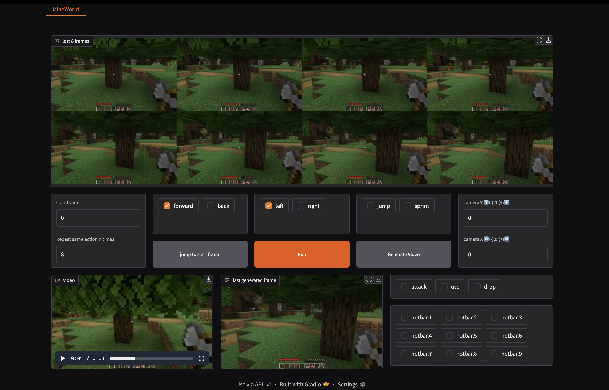

<div align="center">

# MineWorld <br> <sub>A Real-time Interactive World Model on Minecraft</sub>

[](https://arxiv.org/pdf/2504.08388) &ensp; [](https://aka.ms/mineworld) &ensp; [](https://huggingface.co/microsoft/mineworld)
</div>

We introduce MineWorld, an interactive world model on Minecraft that brings several key advancements over existing approaches: 
* 🕹️ **High generation quality**. Built on a visual-action autoregressive Transformer, MineWorld generates coherent, high-fidelity frames conditioned on both visuals and actions. 
* 🕹️ **Strong controllability**. We propose benchmarks for the action-following capacity, where MineWorld shows precise and consistent behavior. 
* 🕹️ **Fast inference speed**. With Diagonal Decoding, MineWorld achieves a generation rate of 4 to 7 frames per second, enabling real-time interaction in open-ended game environments. 

https://github.com/user-attachments/assets/2f5b4740-badd-453c-970d-061abd367f82

## 🔥 News
* April, 2025: 🚀 [MineWorld](https://github.com/microsoft/mineworld) was released!
* March, 2025: 🚀 The paper of [Diagonal Decoding](https://arxiv.org/pdf/2503.14070) was released!

## 🔧 Setup
1. Clone this repository and navigate to MineWorld folder:
```bash
git clone https://github.com/microsoft/mineworld.git
cd mineworld
```
2. We provide an `requirements.txt` file for setting up a pip environment.
```bash
# 1. Prepare conda environment
conda create -n mineworld python=3.10
# 2. Activate the environment
conda activate mineworld
# 3. install our environment
pip3 install -r requirements.txt
```

We recommend using high-end GPU for inference. We have done all testing and development using A100 and H100 GPU. 


## 🎈 Checkpoints
Download pre-trained models [here](https://huggingface.co/microsoft/mineworld). Each checkpoint has a corresponding config file with the same name in the `configs` folder in this repository. All models share the same vae checkpoint and config. The data structure is as follows:
```
└── checkpoints
    ├── 300M_16f.ckpt
    ├── 700M_16f.ckpt
    ├── 700M_32f.ckpt
    ├── 1200M_16f.ckpt
    └── 1200M_32f.ckpt
    └── vae
        ├── config.json
        └── vae.ckpt
└── validation
    └── validation.zip
└── gradio_scene
    ├── scene.mp4
    └── scene.jsonl
```

## 🚀 Inference
We provide two ways to use our model: interacting with it in a web demo, and running locally to reproduce the evaluation results in our paper. In addition to download the checkpoints and place them in the `checkpoints` folder, it is also required to download `scene.mp4` and `scene.jsonl` when running the web demo. Make sure they are placed in the same directory.

### Run Web Demo

To launch the webpage game, run the following command:
```bash
python mineworld.py --scene "path/to/scene.mp4"    
    --model_ckpt "path/to/ckpt" 
    --config "path/to/config" 
```



Once the demo is running, you can access the website through the local URL or the public URL displayed in the command line. Initialization and the first action may take some time due to compilation.

You can specify a reference frame using the `--reference_frame` option, which should be larger than `4` and smaller than the context length of the model (i.e., `16` or `32` depending on the model utilized). A higher reference frame number generally corresponds to better visual quality. Once the initial state has been set, perform the game actions by selecting options in each chatbox.
The game progresses when pressing the "Run" button, displaying the last `8` frames and the most recent frame separately. Players can also set an action count to repeat an action multiple times.

Explanations to the buttons in the web demo are as follows:
```
Start frame: select a frame in scene.mp4 with its frame index
Jump to start frame: use the selected frame as the initial state
Camera `X` and `Y`: control the camera movements between `-90` and `90` degrees
Other action buttons: same as the actions in Minecraft 
Generate video: save previous game progress
```

### Run Local Inference

To run inference locally, use the following command:

```bash
python inference.py \
        --data_root "/path/to/validation/dataset" \
        --model_ckpt "path/to/ckpt" \
        --config "path/to/config" \
        --demo_num 1 \
        --frames 15 \
        --accelerate-algo 'naive' \
        --top_p 0.8 \
        --output_dir "path/to/output"
```

Check `scripts/inference_16f_models.sh` for examples. To switch between naive autoregressive decoding and diagonal decoding, change the command `--accelerate-algo` to `naive` and `image_diagd` correspondingly. 

After the inference of a set of videos, you can compute the metrics and reproduce the numerical results in our paper, check and run the following scripts:
```bash 
bash scripts/setup_metrics.sh # only required in the first time
bash scripts/compute_metrics.sh 
```

The evalution outputs will have the following structure: 
```
└── videos 
    ├── inference_setting1
        ├── clip_1.mp4
        └── clip_1.json
    ├── inference_setting2
        ├── clip_1.mp4
        └── clip_1.json
└── metrics_log
    ├── fvd_inference_setting1.json
    ├── fvd_inference_setting2.json
    ├── idm_inference_setting1.json
    ├── idm_inference_setting2.json
    └── latest_metrics.csv 
```
All results will be aggregated into `metrics_log/latest_metrics.csv`.

## 💡 Intended Uses

Our model is solely trained in the Minecraft game domain. As a world model, an initial image in the game scene will be provided, and the users should select an action from the action list. Then the model will generate the next scene that takes place the selected action.


## 🪧 Out-of-scope Uses

Our models are not specifically designed for any tasks or scenarios other than the Minecraft model. 

Developers should expect failures in generation results regarding the out-of-scope scenarios. 

Developers should be aware of and adhere to applicable laws or regulations (including privacy, trade compliance laws, etc.) that are relevant to their use case, and evaluate and mitigate for privacy, safety, and fairness before using within a specific downstream use case, particularly for high-risk scenarios.

## 🤖️ Risks and Limitations 

Some of the limitations of this model to be aware of include: 
* Quality of Service: MineWorld is trained solely on Minecraft, so it cannot generate results for other video domains (such as internet video). And the model cannot generate videos with higher resolution.
* Information Reliability: MineWorld is trained on videos with a fixed resolution, therefore the results may lose detailed information due to the low resolution. 
* MineWorld inherits any biases, errors, or omissions characteristic of its training data, which may be amplified by any AI-generated interpretations. 
* MineWorld was developed for research and experimental purposes. Further testing and validation are needed before considering its application in commercial or real-world scenarios. 
* The input of other images than Minecraft will result in incoherent imagery being created and should not be attempted.
* Users are responsible for sourcing their datasets legally and ethically. This could include securing appropriate copy rights, ensuring consent for use of audio/images, and/or the anonymization of data prior to use in research.

## ✏️ BibTeX

```bibtex
@article{guo2025mineworld,
  title={MineWorld: a Real-Time and Open-Source Interactive World Model on Minecraft}, 
  author={Guo, Junliang and Ye, Yang and He, Tianyu and Wu, Haoyu and Jiang, Yushu and Pearce, Tim and Bian, Jiang}
  year={2025},
  journal={arXiv preprint arXiv:2504.08388},
}
```

## 🤗 Acknowledgments
This codebase borrows code from [VPT](https://github.com/openai/Video-Pre-Training) and [generative-models](https://github.com/Stability-AI/generative-models). We thank them for their efforts and innovations, which have made the development process more efficient and convenient.

Thank you to everyone who contributed their wisdom and efforts to this project.

## ☎️ Contact

We welcome feedback and collaboration from our audience. If you have suggestions, questions, or observe unexpected/offensive behavior in our technology, please contact us through `junliangguo AT microsoft.com`.

## 📄 Contributing

This project welcomes contributions and suggestions.  Most contributions require you to agree to a
Contributor License Agreement (CLA) declaring that you have the right to, and actually do, grant us
the rights to use your contribution. For details, visit https://cla.opensource.microsoft.com.

When you submit a pull request, a CLA bot will automatically determine whether you need to provide
a CLA and decorate the PR appropriately (e.g., status check, comment). Simply follow the instructions
provided by the bot. You will only need to do this once across all repos using our CLA.

This project has adopted the [Microsoft Open Source Code of Conduct](https://opensource.microsoft.com/codeofconduct/).
For more information see the [Code of Conduct FAQ](https://opensource.microsoft.com/codeofconduct/faq/) or
contact [opencode@microsoft.com](mailto:opencode@microsoft.com) with any additional questions or comments.


## 📍 Trademarks

This project may contain trademarks or logos for projects, products, or services. Authorized use of Microsoft 
trademarks or logos is subject to and must follow 
[Microsoft's Trademark & Brand Guidelines](https://www.microsoft.com/en-us/legal/intellectualproperty/trademarks/usage/general).
Use of Microsoft trademarks or logos in modified versions of this project must not cause confusion or imply Microsoft sponsorship.
Any use of third-party trademarks or logos are subject to those third-party's policies.
